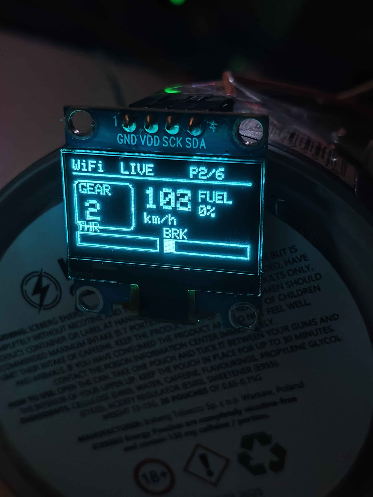
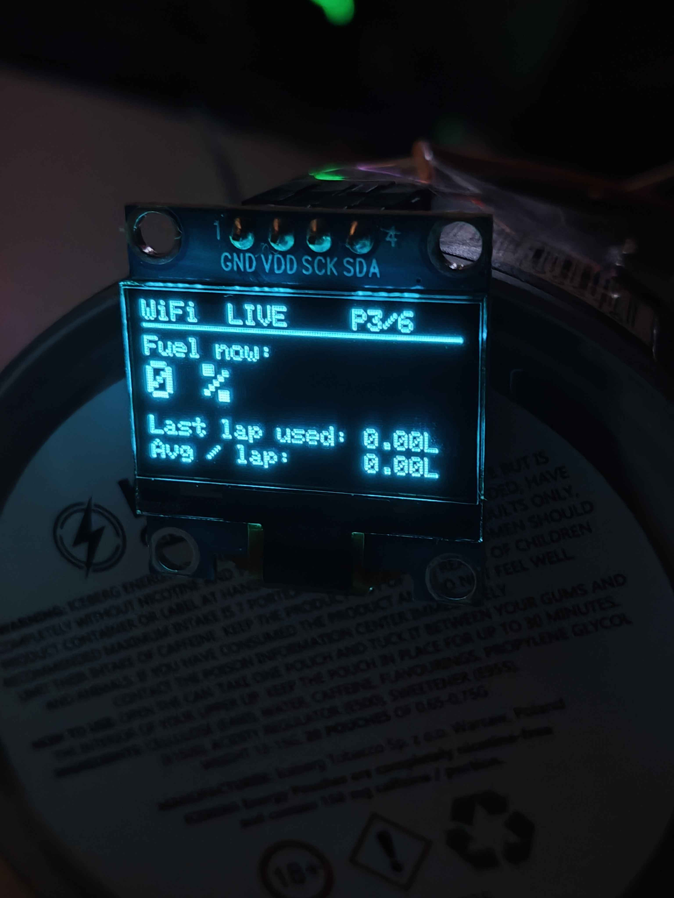
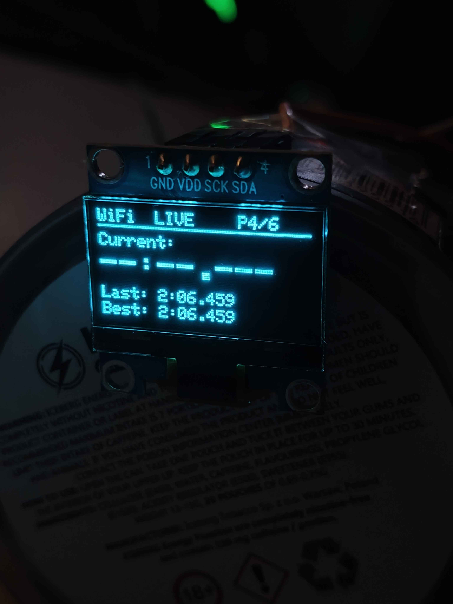
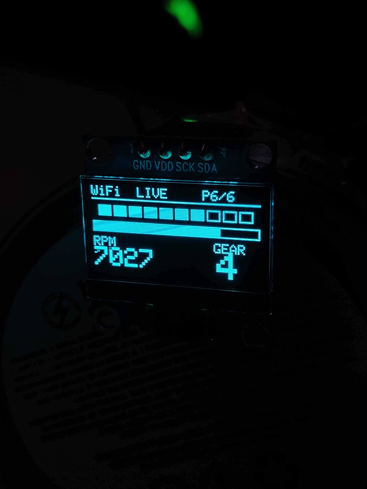

# ICTGabe-iRacing-Telemetry-LCD
A Simple Arduino project file for ESP32-D and a python script for PC that is running iRacing      
I used the ESP-32 Dev Module in Arduino


Also LCD has 5 panels      

Logic pin setup: D21 (SDA), D22(SCK), 3v3 (VDD)       
In between brackets are for LCD and pins for ESP32-D, also a button on D27      


Python script is for the PC using iRacing    


Note: IP's are static and the WIFI needs to be WPA-2 and 2.4GHz

for PC you need iRacing SDK       
```    
pip install pyirsdk   
```

usage of the script:      
```      
python3 iracing_udp_bridge.py (normal logging with csv)        
python3 iracing_udp_bridge.py -l (live without logging)     
```    


pictures of dashes:      
    
     
     
     
     
     
